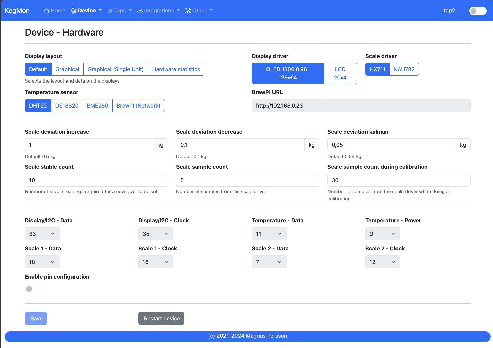
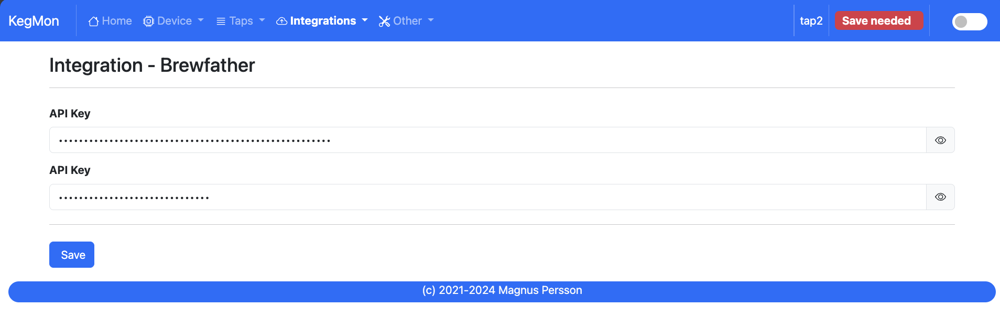
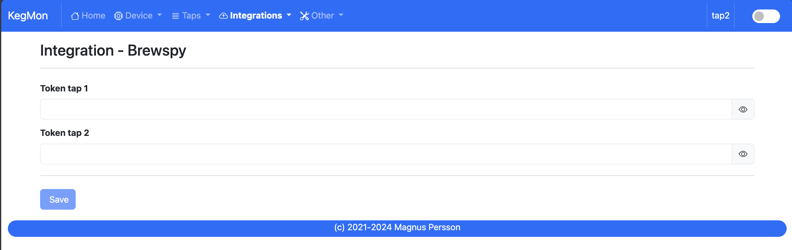
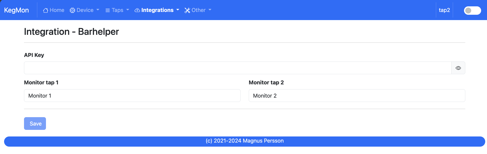
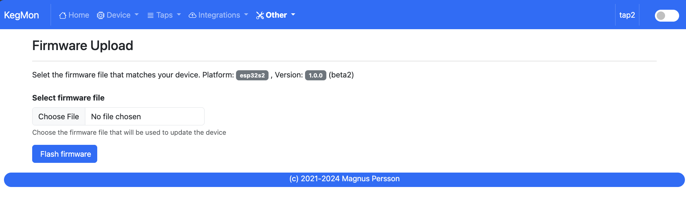

.. _software:

Software
--------

Index
*****

This is the web page accessed by accessing the device via a web-browser. This section will show the general device information.

Shows information about the device and temperatures, only data available will be shown.

Device - Settings
*****************

.. image:: images/view_device_settings.png
  :width: 600
  :alt: Device Settings

* **Device name**: Set the name of the device on the network, your network needs to support mDNS.

* **Temperature format**: Select format for temperatures

* **Weight unit**: Select format for weights

* **Volume unit**: Select format for volumes

* **Dark Mode**: Switches the UI between light and dark mode. You can also use the toggle on the menubar for that.

Device - Hardware
*****************

TODO: Missing hardware screen dump

* **Display layout**: Choose the layout/information on the displays.

* **Display driver**: Choose the what display driver is used, either LCD 20x4 or OLED 0.96". Default is OLED 0.96".

* **Temp sensor**: Choose the what temp sensor is used, either DHT22, BME280, DS18B20 or remote BrewPI-ESP installation. Default is DS18B20. *Wiring for BME280 is different*.

* **Scale sensor**: Choose the what ADC is used, HX711 or NAU7802. Default is HX711. *Wiring for NAU7802 is different*.

* **BrewPI ESP URL**: Base URL for the brewpi-esp to fetch temperature from. Require v15 or later. 

* **Pins**: If you dont follow the standard hardware wiring then you can customize the pins here.

Device - Calibration
*********************

.. image:: images/view_device_calibration.png
  :width: 600
  :alt: Device calibration

* **STEP 1 - Tare scale**

The first step is to tare the scale. First select the scale from the dropdown list that you 
want to operate on. Make sure the scale is empty.

* **STEP 2 - Calculate factor**

The second step is to calculate the factor used to calculate the weight. Place a thing with a 
known weight on the scale and enter the weight of that object. The software will then calculate
the factor for estimating the weight. 

* **STEP 3 - Validate**

The third step is to validate that everything works, place anohter thing with a know weight and 
check the measured value. If you are satisfied then you are done.

Device - Wifi
*************

.. image:: images/view_device_wifi.png
  :width: 600
  :alt: Device wifi

* **SSID #1:**

  Select the desired primary SSID to use. 

* **Password #1:**

  Enter the primary password. 

* **SSID #2:**

  Select the desired secondary SSID to use (optional). 

* **Password #2:**

  Enter the secondary password (optional). 

* **Portal timeout:**

  If the wifi portal is triggered (can be triggered by tapping the reset button 2-3 times within 3 seconds) then this is the amount of time allowed before it exists again.

* **Connect timeout:**

  This is the amount of time allowed for a wifi connect. 

Tap Settings
************

* **Empty keg weight**: Weight of the empty keg, used to determine how much beer is in the keg.

* **Glass volume**: Choose the volume of the beer glasses, used to determine how many pours are left. 

* **Beer name**, **Beer ABV**, **Beer EBC**, **Beer IBU**: Information about the beer, used to show on user interfaces.

* **Beer FG**: Used in formula for calculating the beer volume. FG has a slight impact on the weight / volume unit. If not defined 1 will be used for calculations.

Tap Settings
************

.. image:: images/view_taps_beers.png
  :width: 600
  :alt: Tap beers

Shows information about beers on tap. Use the buttons to import from brewspy or brewfather.

Integration - Home Assistant
****************************

Setting for MQTT server that is used by Home Assistant.

Integration - Brewfather
************************

API and User keys for access to brewfather

Integration - Brewspy
*********************

Brewspy tokens for keg 1 & keg 2.

Integration - Barhelper
***********************

Barhelper API keys and name of monitors.

History
*******

TODO: Not yet implemented in new UI

Stability
*********

TODO: Not yet implemented in new UI

Information page that can determine the stability of your hardware build.

I have found that some of my hardware builds was not really stable so I added this 
feature to check the scale build before doing the final assembly. 

If you keep the browser open you can also see the history of the values (raw, kalman & stable). This can help to show
how your scale varies over time. Data is only stored in the browser so any refresh or page change will delete the graphs.

Serial console
**************

Here you can view the serial output from the device for troubleshooting

Backup & Recovery
*****************

.. image:: images/view_other_backup.png
  :width: 600
  :alt: Backup configuration

Backup your configuration or restore it from a previous state

Firmware update
***************

Here you can upload a new firmware version without the need to hook the device to a serial port 
on your computer.

Support
*******

.. image:: images/view_other_support.png
  :width: 600
  :alt: Support information

View logs or check the hardware configuration

Tools
*****

Interact with the file system on the device
