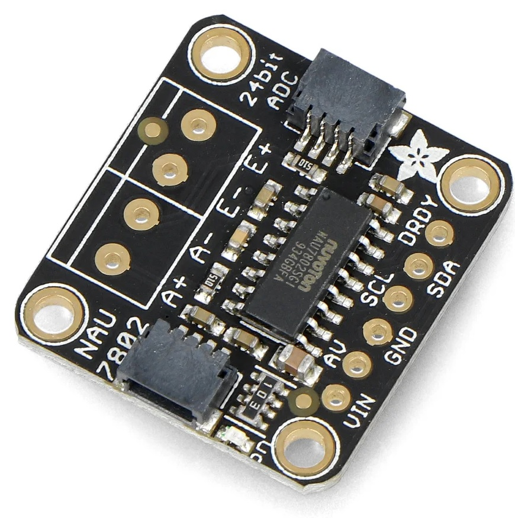
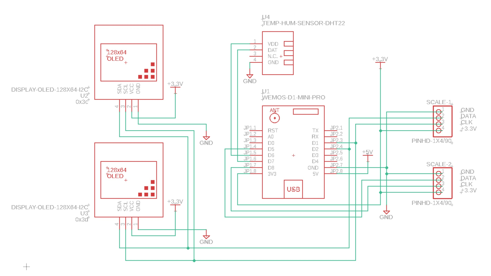
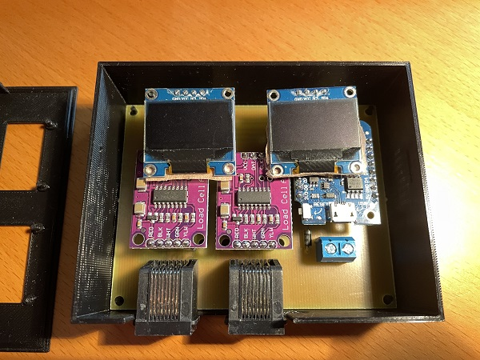

.. _hardware:

Hardware 
--------

Introduction
============

The software will adopt to what external sensors are connected and will work with 
one, two scales, one or two displays and with/without a temperature sensor. 

The graph here shows two of my scales in my keezer where the second one (lower graph) is quite 
stable over time. The first one is not. The difference is over 2 kg and it goes back to the previous 
weight after a few hours. 

.. image:: images/hx_drift.png
  :width: 600
  :alt: Scale drift

HX711
=====

I found 3 main types of HX711 boards and the green board has a different pin configuration compared to the 
other boards. 

.. image:: images/hx711-options.png
  :width: 600
  :alt: HX711 boards

* Green: Most common board when searching for HX711
* Red: Sparkfun board
* Purple: A variation of the Sparkfun board

The SparkFun board is the most expensive one but has one major advantage. You can power it on +5V and 
configure it to use 3.3V digital signal levels (using VCC and VDD pins). 

The main option used in this project is the purple HX711 board. The green board dont have the same pin configiuration 
so this will not work with the PCB design.

NAU7802
=======

This is the alternative ADC which is quite new and I have not had the time yet to validate the long term stability. 

These boards use the I2C bus for communication so these needs a differnt hardware wiring. Since you cannot change the 
adress on these boards you need to an ESP32 if two scales will be connected since the ESP8266 only supports one I2C bus.

.. note::
  If you are using this you need to change this in the configuration menu and restart the device for it to work 
  properly. 

Schema for HX711
================

.. note::
  The temperature sensor is installed in the scale base and you can use either a DS18B20, DHT22 or BME280. I would recommend 
  the DS18B20 since that is more stable and cheaper than the DHT22. The BME280 uses an I2C bus so this will require a different 
  wiring than the other options.

This is the schema used for the default hardware options. 

.. image:: images/schema.jpg
  :width: 600
  :alt: Default hardware options

Schema for NAU7802
==================

This is the schema used for the NAU7802 boards. Scale 1 uses the same pins as the OLED displays. Scale 2 uses the same pins as 
for the HX711. So D3/D4 is unused in this variant. 

.. note::
  I'm considering to update the hardware design to fit a larger OLED display 1.3" and multiple NAU7802 on the ESP8266 platform but 
  this will require an i2c extender to avoid adress overlap. 

.. note::
  Note that the ESP8266 only supports one I2C bus so with that processor only one scale can be used. Recommend to use ESP32S2/S3 which 
  can support both NAU7802 scales.

Case
====
In this version the HX711 boards are moved to the case with the displays. The hope is that 
this would stabilize the sensor readings and also make it easier to replace a faulty scale. 

Part list:

* U1 - Wemos ESP8266 D1 mini - option 1
* U1 - Wemos ESP32 S2 mini - option 2
* U2/U3 - 0.96" 128x64 I2C OLED display (i2c adresses, 0x3c + 0x3d) - option 1
* U2/U3 - LED 20x4 I2C display (i2c adresses, 0x27 + 0x26) - option 2
* R1 - 4.7k (only used with HX711)
* R2 - 4.7k (only used with HX711)
* R3 - 3.3k
* 2 x HX711 boards
* 5V power supply
* RJ45 connectors if you want to remove the scales
* PCB (work in progress)
* 3D printed case for displays and esp8266 (work in progress)

R1 and R2 are just used to pull the CLK to +3.3V or the code will not detect 
that scales are missing (floating input). You can use most values between 
2k and 5k for that.  

It's possible to use the NAU7802 boards to replace the HX711 ADC. Two scales is only supported on the ESP32 platform since it requires 
two i2c bus instances. The wiring is different if you choose this option. 

* 2 x NAU7802 boards (require the ESP32S2/S3 for two scales)

Images below shows examples of a HX711 board and RJ45 breakout board. 

.. image:: images/HX711_component.jpg
  :width: 300
  :alt: HX711 board

If you are using the Sparkfun board I suggest that you power the HX711 board with +5V (VCC) and +3.3V (VDD) 
so the digital interface is compatible with the ESP. 

.. image:: images/rj45_board.jpg
  :width: 300
  :alt: RJ45 board

.. list-table:: ESP pins
   :widths: 60 20 20
   :header-rows: 1

   * - Function
     - ESP8266
     - ESP32S2
   * - DISPLAY SDA 1 and 2
     - D2
     - 33
   * - DISPLAY SCL 1 and 2
     - D1
     - 35
   * - NAU7802 SDA 1
     - D2
     - 33
   * - NAU7802 SCL 1
     - D1
     - 35
   * - HX711 DATA 1
     - D3
     - 18
   * - HX711 CLK 1
     - D4
     - 16
   * - HX711 DATA 2
     - D5
     - 7
   * - HX711 CLK 2,
     - D8
     - 12
   * - NAU7802 SDA 2
     - D5
     - 7
   * - NAU7802 SCL 2
     - D8
     - 12
   * - Data to DHT22 or DS18B2
     - D7
     - 11
   * - BME280 SDA
     - D2
     - 33
   * - BME280 SCL
     - D1
     - 35
   * - Power to DHT22, DS18B2, BME280
     - D6
     - 9

Building the display case
*************************
  
First step is get a pcb and to print the two case parts. This first version is a one sided pcb. 
In the future there will be a multisided one. 

The models for the case is found under the /3d folder and the pcb files under /schema

Solder the components / or the mounting pins to the PCB as shown in the image below.

.. image:: images/board.jpg
  :width: 600
  :alt: Soldering

Here is a view with all the components mounted.

.. image:: images/soldered.jpg
  :width: 600
  :alt: Soldered all components

Fit into the case.

I use hot glue to fix the displays in place. 

.. image:: images/oled_mount.jpg
  :width: 600
  :alt: Mounting displays

Here is a view of the completed build.

.. image:: images/case.jpg
  :width: 600
  :alt: Complete

Scale Base
==========

In this version the base is just a frame for the load cells and the temperature sensor. 
Each base will have the same build process but only the temperature sensor of one will be used.

* 3D printed base
* 3D printed cover
* 4 load cells 
* CAT6 network cable
* U4 - DHT22 temp and humidity sensor (optional, alternative 1)
* U4 - DS18B20 temp sensor (optional, alternative 2)
* U4 - BME280 temp sensor (optional, alternative 3)
* Load Combinator PCB (optional)

.. image:: images/loadcombinator_board.jpg
  :width: 300
  :alt: Load Combinator board

Building the base
*****************

Print the 2 base models and 2 covers. Files can be found in the sub-model directory. 
These models are designed to be printed on my Prusa MK3s+ and support a Cornelius  
kegs of 9, 18 or 19 l.

`An alternative design can be found here <https://github.com/darkside90a/kegmon-base>`_

You can of course print or build a different mount for the load cells. Just check the 
internet and you will find several options. Mount the load cells in the base and wire 
the HX711 board to the load cells as shown in the next picture. Excellent guide on how to
`hook up loadcells and use the combinator board <https://learn.sparkfun.com/tutorials/load-cell-amplifier-hx711-breakout-hookup-guide/all>`_

First I start with soldering some wires to the DHT22 sensor so I can mount that in
the base together with the load cells. You can also use a DS18B20 sensor which is wired 
in the same way (Power, GND, Data).

.. image:: images/dht22.jpg
  :width: 300
  :alt: dht22

.. image:: images/keg_base_loadcell.jpg
  :width: 600
  :alt: Load cells mounting

When you shorten the cables, make sure all of them are of the same length. Since the HX711 AD Converter will go in the display case the 
network cable will extend these cables anyway. 

.. image:: images/hx711.jpg
  :width: 600
  :alt: HX711

I used a flat network cable (CAT6) for the connection between the bases and the HX711/ESP8266 and this is 
what the result looked like. The cover will be glued on top of this at a later stage (preferably 
when it works correcly). You can also use a shielded cable that would be more resistent too external
interferece.

Typically the colors of the load cells are black (-), white (+) and red (out). If you use the combinator board then C is for the read (out signal). But 
to be sure measure the resistance and it should be 1.5k over the +/- cables (or the highest resistace). 

.. image:: images/keg_base_wired.jpg
  :width: 600
  :alt: Wired base

Now the base is built and the next step is to test the stability over time. I hook up the base and calibrate it to so I'm happy with the base load. Then I 
let the weight rest on the scale for a couple of days to see how much deviation there is. In the software there is a feature for measuring the 
stability over time (Config->Stability). Once you have calibrated and placed the weight on the scale, navigate to this menu item and clear the values. These will only 
be reset at startup or when pressing the button.

CAT6 Wire Usage
***************

I used the following wires in the network cable to connect to each base. I used the combinator board to hook 
up all the cables from the load cells. You dont need that but I found it easier to keep track of what goes where. 
The base is quite thin so I cannot fit an RJ45 connector on the board so i'm connecting the cable wires directly to the 
combinator board.  

.. list-table:: CAT Wiring
   :header-rows: 1

   * - Wire (T568B)
     - HX711
     - NAU7802
   * - Orange-White (PIN 1)
     - GND to DHT22, DS18B20, BME280 (GND)
     - GND to DHT22, DS18B20, BME280 (GND)
   * - Orange (PIN 2)
     - Power to DHT22, DS18B20, BME280 (+3.3V)
     - Power to DHT22, DS18B20, BME280 (+3.3V)
   * - Green-White (PIN 3)
     - E- (or BLK on HX711)
     - E- (or BLACK on NAU7802)
   * - Blue (PIN 4)
     - A+ (or GRN on HX711)
     - A+ (or GREEN on NAU7802)
   * - Blue-White (PIN 5)
     - A- (or WHT on HX711)
     - A- (or WHITE on NAU7802)
   * - Green (PIN 6)
     - E+ (or RED on HX711)
     - E+ (or RED on NAU7802)
   * - Brown-White (PIN 7)
     - GND or BME280 (SCL)
     - GND or BME280 (SCL)
   * - Brown (PIN 8)
     - Signal from DHT22, DS18B20 or BME280 (SDA)
     - Signal from DHT22, DS18B20 or BME280 (SDA)

