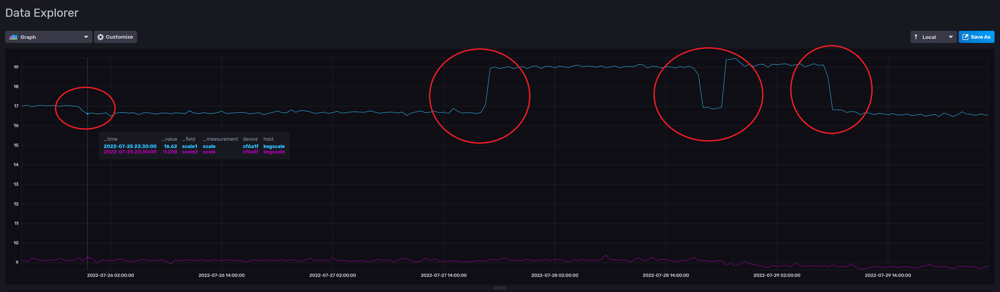
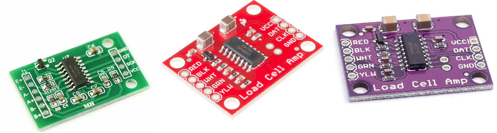
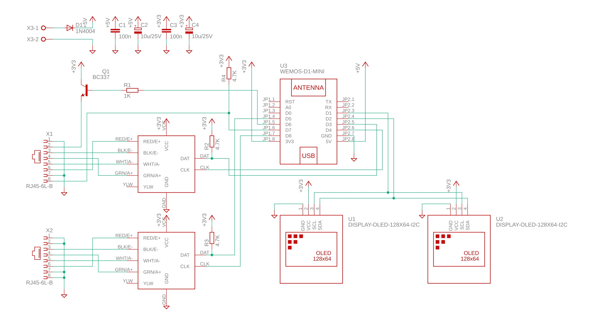
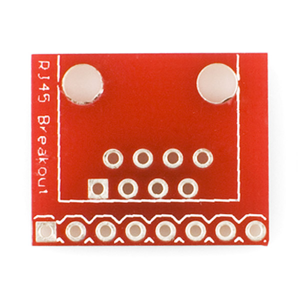
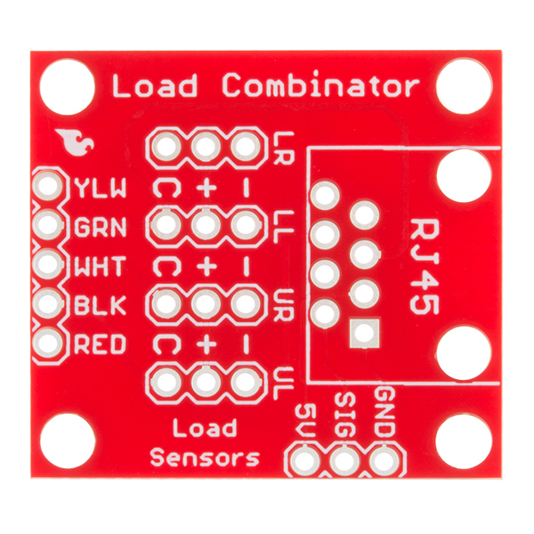
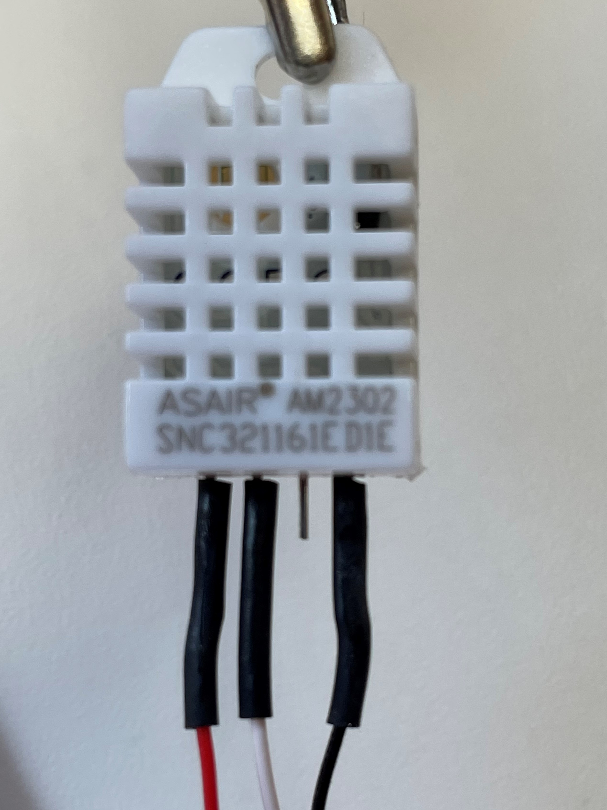
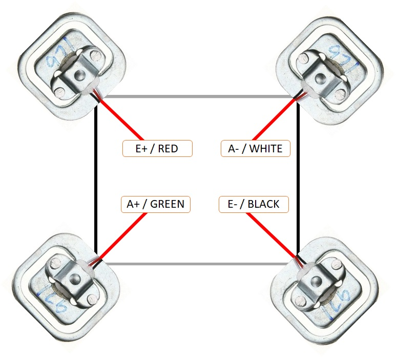
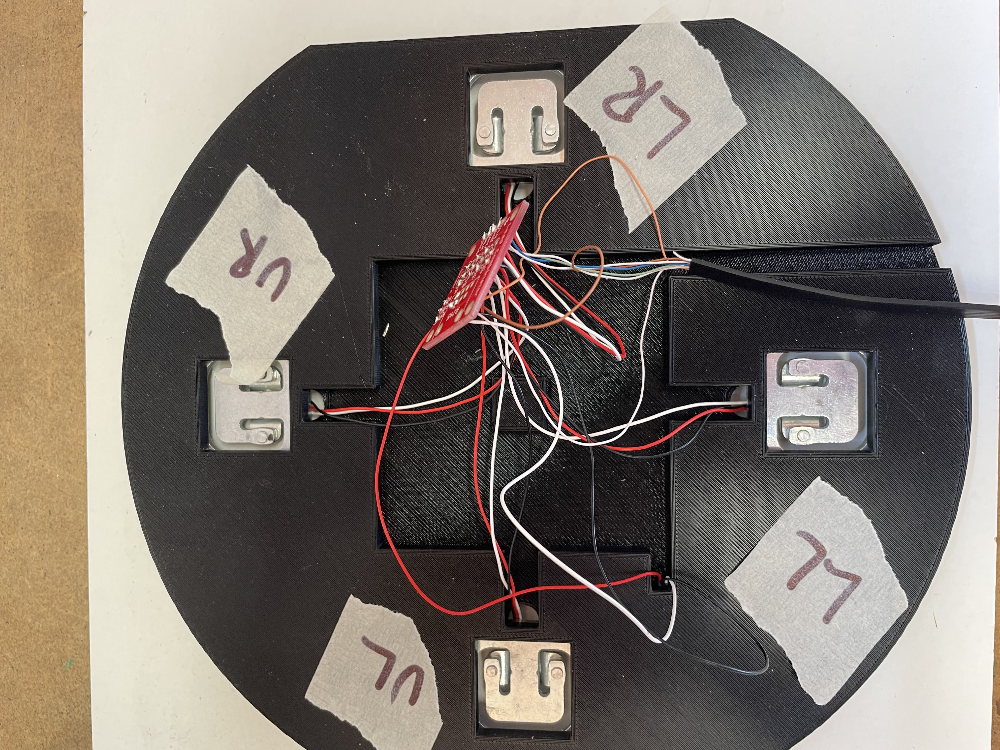
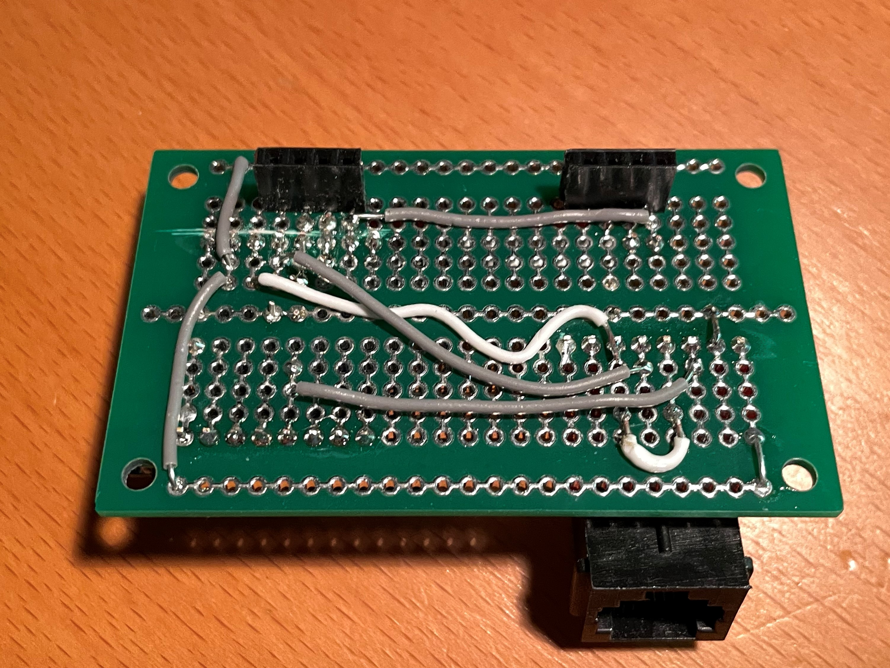
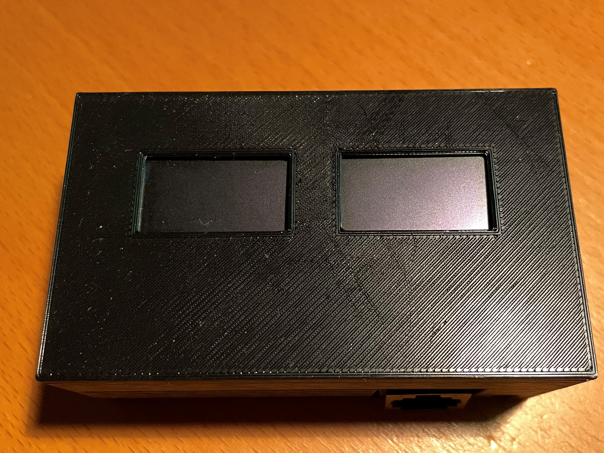

.. _hardware:

Hardware 
--------

This is the hardware schema that I have used in my build. 

.. note::
  The software will adopt to what external sensors  are connected and will work with 
  one, two scales, one or two displays and with/without a temperature sensor. 

I noticed that my first build was really unsable, it could vary +/- 2kg over time. I've already
added some features to the software to filter out the varying readings but these large changes are difficult 
to fix with software. So I need to determine if this is related to software or hardware. 

The graph here shows two of my scales in my keezer where the second one (lower graph) is quite 
stable over time. The first one is not. The difference is over 2 kg and it goes back to the previous 
weight after a few hours. 

So I'm currently trying to change the hardware setup in order to determine the source of the error. I found 3 main 
types of HX711 boards. 

* Green: Most common board when searching for HX711
* Red: Sparkfun board
* Purple: A variation of the Sparkfun board

The SparkFun board is the most expensive one but has one major advantage. You can power it on +5V and 
configure it to use 3.3V digital signal levels (using VCC and VDD pins). 

1. For my first build I used the Green board and placed that in the base of the scale. With this approach I 
had issues with drift and varying readings. I built two scales and one had issues,the other not.

2. For the second build I moved the hx711 to the display case only keeping the load cells in the scale 
base. I also changed to the purple board powered by 3.3V, currently that option works perfect with my 
two first scales. 

3. I discovered when running 2 scales that sharing the CLK signal to the HX711 was not a good idea, that introduced 
errors in the accuracy. So in v0.4.0 I changes the CLK signal on the second scale to D8. 

.. note::
  I'm currently updating the 3d model for the display case to fit the larger board. 

Schema
******

Part list:

Case
----
In this version the HX711 boards are moved to the case with the displays. The hope is that 
this would stabilize the sensor readings and also make it easier to replace a faulty scale. 

.. note::
  I will update the hardware design to fit a larger OLED display 1.3". This will require a different
  display driver on the software side. I'm also considering to update the software/design to an 
  ESP32 for more processing power. 

* U1 - Wemos D1 mini (I used the v3.0 version)
* U2 - 0.96" 128x64 I2C OLED display (with option to change i2c adress, 0x3c)
* U3 - 0.96" 128x64 I2C OLED display (with option to change i2c adress, 0x3d)
* R1 - 4.7k
* R2 - 4.7k
* 2 x HX711 boards
* 3D printed case for displays and esp8266
* 5V power supply
* RJ45 connectors (optional)

R1 and R2 are just used to pull the CLK to +3.3V or the code will not detect 
that scales are missing (floating input). You can use most values between 
2k and 5k for that.  

Images below shows examples of a HX711 board and RJ45 breakout board. I use the breakout board since I 
havent yet created my own PCB, I want to stabilize the hardware design first.

.. image:: images/HX711_component.jpg
  :width: 300
  :alt: HX711 board

If you are using the Sparkfun board I suggest that you power the HX711 board with +5V (VCC) and +3.3V (VDD) 
so the digital interface is compatible with the ESP. 

Base (for one)
--------------
In this version the base is just a frame for the load cells and the temperature sensor. 
Each base will have the same build process but only the temperature sensor of one will be used.

* 3D printed base
* 3D printed cover
* 4 load cells 
* CAT6 network cable
* U4 - DHT22 temp and humidity sensor (optional)
* Load Combinator PCB (Optional)

Building the base
*****************

Print the 2 base models and 2 covers. Files can be found in the sub-model directory. 
These models are designed to be printed on my Prusa MK3s+ and support a Cornelius  
kegs of 9, 18 or 19 l.

You can of course print or build a different mount for the load cells. Just check the 
internet and you will find several options. Mount the load cells in the base and wire 
the HX711 board to the load cells as shown in the next picture. Excellent guide on how to
`hook up loadcells and use the combinator board <https://learn.sparkfun.com/tutorials/load-cell-amplifier-hx711-breakout-hookup-guide/all>`_

First I start with soldering some wires to the DHT22 sensor so I can mount that in the base together with the load cells. 

.. image:: images/keg_base_loadcell.jpg
  :width: 600
  :alt: Load cells mounting

When you shorten the cables, make sure all of them are of the same length. Since the HX711 AD Converter will go in the display case the 
network cable will extend these cables anyway. 

I used a flat network cable (CAT6) for the connection between the bases and the HX711/ESP8266 and this is 
what the result looked like. The cover will be glued on top of this at a later stage (preferably 
when it works correcly). 

Now the base is built and the next step is to test the stability over time. I hook up the base and calibrate it to so I'm happy with the base load. Then I 
let the weight rest on the scale for a couple of days to see how much deviation there is. In the software there is a feature for measuring the 
stability over time (Config->Stability). Once you have calibrated and placed the weight on the scale, navigate to this menu item and clear the values. These will only 
be reset at startup or when pressing the button.

CAT6 Wire Usage
***************

I used the following wires in the network cable to connect to each base. I used the combinator board to hook 
up all the cables from the load cells. You dont need that but I found it easier to keep track of what goes where. 
The base is quite thin so I cannot fit an RJ45 connector on the board so i'm connecting the cable wires directly to the 
combinator board.  

.. list-table:: CAT Wiring
   :header-rows: 1

   * - Wire
     - Function
   * - Orange
     - Power to DHT22 (+3.3V)
   * - Orange-White
     - GND to DHT22 (GND)
   * - Blue
     - A+ (or GRN on HX711)
   * - Blue-White
     - A- (or WHT on HX711)
   * - Green
     - E+ (or RED on HX711)
   * - Green-White
     - E- (or BLK on HX711)
   * - Brown
     - Signal from DHT22
   * - Brown-White
     - Not used

Building the display case
*************************

.. warning::
  This part will be updated once I have received my new 1.3" displays and changed the design to cover the HX711 boards. This section 
  is for the previous build with the HX711 in the scale base.
  
First step is to print the case parts and mount the OLED displays to the front. I use hot glue to fix the displays in place. 

.. image:: images/oled_mount.jpg
  :width: 600
  :alt: Mounting displays

The next step is to build the PCB where I used a standard experiment board with wire to build that up. I didnt want to spend time 
on creating a PCB for the prototype. Might be something for the future. Just follow the schematic and validate your connections.

To make the connection easy with the scales I put on a rj45 (standard network connector) which I can just plug in to the display case.
There are other options available on the internet for both 1 and 2 displays. 

.. image:: images/rj45_esp.jpg
  :width: 600
  :alt: ESP and network

This is the side which is mounted to the displays.

This is the finished part. (have not wired in the power supply yet)

