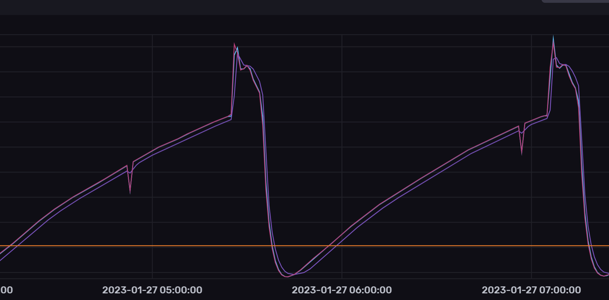
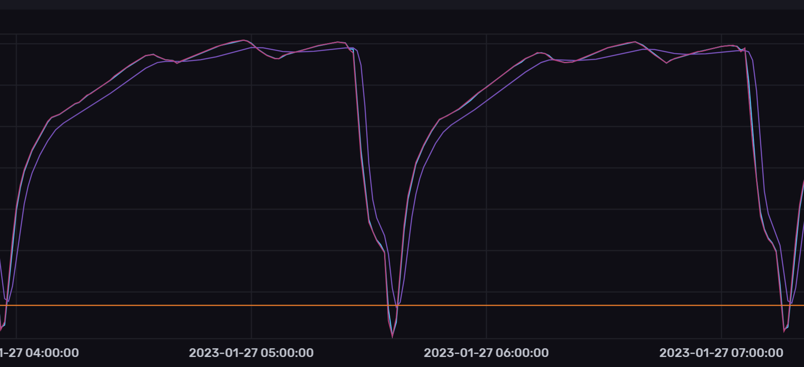

.. KegMon documentation master file, created by
   sphinx-quickstart on Tue Jun  7 09:29:30 2022.
   You can adapt this file completely to your liking, but it should at least
   contain the root `toctree` directive.

Welcome to KegMon - Keezer Level Monitor
----------------------------------------

.. note::
  Reflects test version **v0.7.1*, Last updated 2023-08-03

Introduction
============

The software is tailored towards my personal needs and external services that I use, but suggestions are always 
welcome. 

The software has two interfaces, one via the OLED displays and one via the web-browser, integrations with external 
services is available, currently BrewFather, BrewSpy and Home Assistant. If you have requests for other services 
raise a request on github. 

Two ADC types are supported, the HX711 and the NAU7802 (requires ESP32S2 for two scales).

The cheap load cells are quite unpredicteble so it's hard to get a fully accurate and stable system. In order to 
compensate for this I have built in the possibility to add filters and clean up the values, these filters include:

* raw average (makes an average over the last 10 readings)
* kalman (smooths out the peaks readings, but slows down level detection)
* temperature adjustment (this is not yet active, but its possible to add a formula and adjust the weight, for instance compensate for temperature)

Here are two views on the data change over time, the temperature in my keezer is between 4 and 5 degress Celcius. My two 
scales behave diffrently even though the load cells are from the same batch. I guess that the peak in the first 
graph is due to interference from the compressor when it starts to cool. The orange line shows the stable level that 
is used. Level change is triggered by a change up or down of more than the threasholds. In the image below the peak 
is approx 16-20 cl above the stable level, so its not a big difference.  

Since the level will vary slightly based on the temperature (on my scale +0.04 to -0.01 kg), I have added a level detection algorithm
that uses the average level over time and dont adjust unless the delta is larger than the defined threasholds (can be set in configuration).

In order to trigger a level change then both the raw values and the kalman value needs to be aligned and the minium level change 
must exceed 10 cl. This means that a pour needs to be more than this level. It can take up to 60 seconds for a new level to 
be detected and a pour registered. This means that if you pour a number of glasses quickly, this will be detected as 
one large pour. 

The design is created for 2 kegs but it will work if you only use one (make sure to use the pins for scale 1 in that case). 

The OLED screens will show the name of the beer, abv and alternate between weight and pours. The first screen will display 
values for keg 1 and the second for keg 2.

The values presented on the OLED screen is the raw values so that you can see directly if the level changes. Stable values can be screen
at the web UI or via the external integrations.

The software will detect how many hx711 boards are connected and if there is a temperature sensor. 

The project contains the following parts:
* Software that manage the scale and present the readings
* Hardware design based on standard HX711 AD converter with load cells and temperature sensor (PCB is work in progress)
* 3D models for the base
* 3D models for display case (work in progress)

TODO list
=========
* Complete compensation formula for temperature compensation
* Create PCB 
* Finalize 3D model for case

Credits to
==========
Thanks to the following projects.

* https://github.com/mp-se/gravitymon
* https://github.com/mp-se/espframework
* https://github.com/graphitemaster/incbin
* https://github.com/khoih-prog/ESP_WiFiManager
* https://github.com/thijse/Arduino-Log
* https://github.com/bblanchon/ArduinoJson
* https://getbootstrap.com
* https://jquery.com
* https://chartjs.org
* https://github.com/bogde/HX711
* https://github.com/ThingPulse/esp8266-oled-ssd1306
* https://modelviewer.dev/
* https://github.com/RobTillaart/Statistic
* https://github.com/denyssene/SimpleKalmanFilter

.. toctree::
   :maxdepth: 2
   :caption: Contents:

   
   functionality
   releases
   intro
   hardware
   3dmodels
   installation
   configuration
   license
   q_and_a

Indices and tables
==================

* :ref:`genindex`
* :ref:`modindex`
* :ref:`search`

