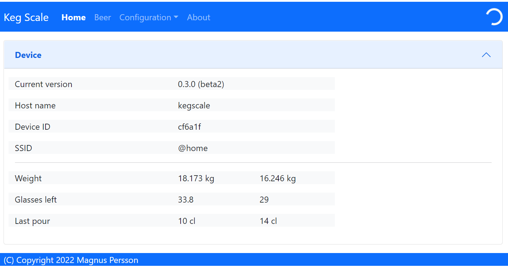
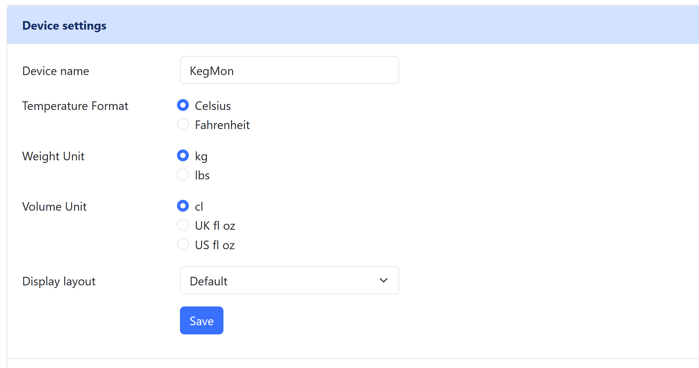
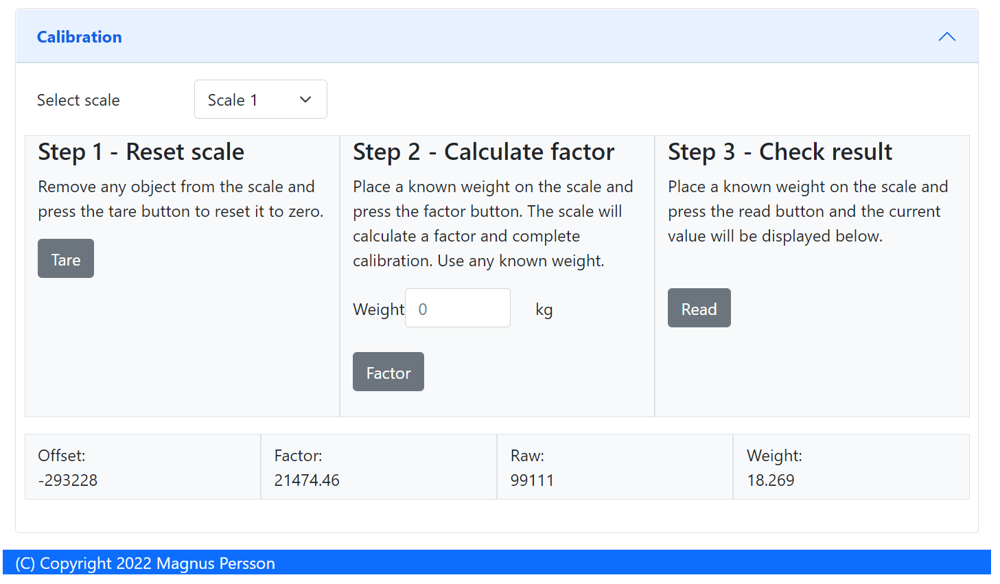
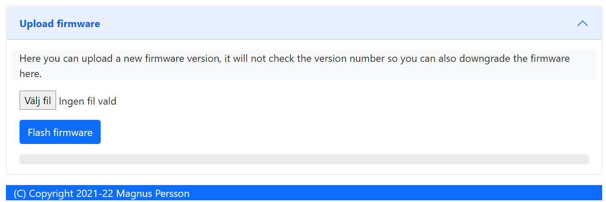

.. _software:

Software
--------

THe software is tailored towards my personal needs and external service 
that I use. The software has two interfaces, one via the OLED displays and 
one via the web-browser.

Installation
************

To be defined.

WIFI
****

To be defined.

OLED Screens
************

The OLD screens will show the name of the beer, abv and alternate between kg and pints. The first 
screen will display values for keg 1 and the second for keg 2.

Index
*****

This is the web page accessed by accessing the device via a web-browser. This 
section will show the general device information.

* **Current version**

Shows the current software version.

* **Host name**

Name of the device on the network.

* **Device ID**

ESP8266 chip ID.

* **SSID**

Name of network we are connected to.

* **Temperature**

Temperature reading, not shown if there is no sensor.

* **Humidity**

Humidity reading, not shown if there is no sensor.

* **Weights**

Shows weighs for scale 1 and 2.

* **Pints**

Shows pints left for scale 1 and 2. You need to configure the weights under the configuration page.

Configuration
*************

This is where the software is configured. 

* **Device name**

Set the name of the device on the network, your network needs to support mDNS.

* **Weight precision**

How many deciamls will be shown for weight.

* **Brewfather user key**

Brewfather user key.

* **Brewfather API key**

Brewfather API key.

* **Empty keg weight**

What is the weight of your empty key, two fields for keg 1 + keg 2.

* **Pint of beer weight**

What is the weight of a pint of beer (or the normal glass you use), two fields for keg 1 + keg 2.

* **Beer name**

Name of the beers, two fields for keg 1 + keg 2. This data can be fetched from brewfather.

* **Beer ABV**

ABV of the beers, two fields for keg 1 + keg 2. This data can be fetched from brewfather.

Calibration
***********

This is the page where you can calibrate your scales. 

* **STEP 1 - Tare scale**

The first step is to tare the scale. First select the scale from the dropdown list that you 
want to operate on. Make sure the scale is empty.

* **STEP 2 - Calculate factor**

The second step is to calculate the factor used to calculate the weight. Place a thing with a 
known weight on the scale and enter the weight of that object. The software will then calculate
the factor for estimating the weight. 

.. note::
  I need to do more testing in order to have recommendations on what is a good option for this.

* **STEP 3 - Validate**

The third step is to validate that everything works, place anohter thing with a know weight and 
check the measured value. If you are satisfied then you are done.

Firmware update
***************

Here you can upload a new firmware version without the need to hook the device to a serial port 
on your computer.

