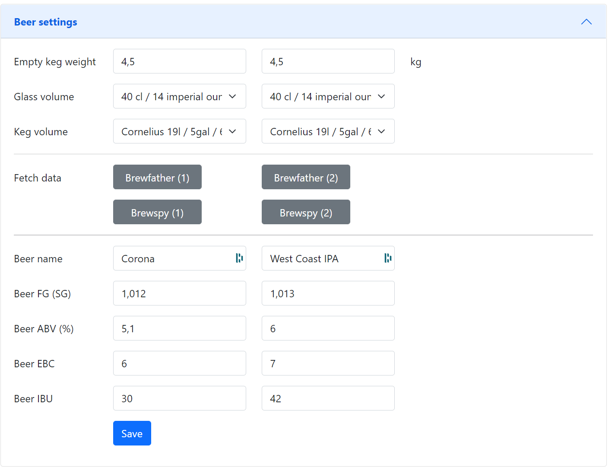
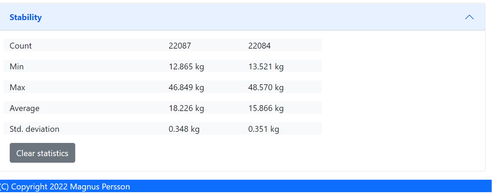

.. _software:

Software
--------

THe software is tailored towards my personal needs and external services 
that I use, but suggestions are always welcome. The software has two interfaces, 
one via the OLED displays and one via the web-browser.

The cheap load cells are quite unpredicteble so it's hard to get a fully accurate system, but they are really
cheap. 

In order to compensate for this I have build in the possibility to add filters and clean up the read values, 
these filters include:

* raw average (makes an average over the last 10 readings)
* kalman (smooths out the peaks readings, but slows down level detection)
* formula adjustment (this is not yet active, but its possible to add an equation to adjust the weight, for instance compensate for temperature)

Here are two views on the data change over time, the temperature in my keezer is 
between 4 and 5 degress Celcius. My two scales behave diffrently even though the 
load cells are from the same batch. I would guess that the peak in the first graph is due to 
interference from the compressor when it starts to cool.

.. image:: images/temp_variation.png
  :width: 400
  :alt: Scale variation

.. image:: images/temp_variation2.png
  :width: 400
  :alt: temp_variation

Since the level will vary slightly based on the temperature (on my scale +0.04 to -0.01 kg), I have added a level detection algorithm
that uses the average level over time and done adjust unless the delta is larger than the defined threasholds (can be defined).

I have prepared for adding a temperature correction option but I'm still working defining a formula for that weight compensation. 

In order to trigger a level change then both the raw values and the kalman value needs to be aligned and the minium level change 
needed to detect a pour is by default set to 10 cl. It can take up to 60 seconds for a new level to be detected and a pour registered.

Installation
************

If there is an interest let me know and I will add the project to brewflasher for easier flashing.

WIFI
****

To be documented. 

OLED Screens
************

The OLD screens will show the name of the beer, abv and alternate between weight and pours. The first 
screen will display values for keg 1 and the second for keg 2.

The values presented on the screen is the raw values so that you can see directly if the level changes. 

Index
*****

This is the web page accessed by accessing the device via a web-browser. This 
section will show the general device information.

.. image:: images/index.png
  :width: 600
  :alt: Index

* **Temperature**

Temperature reading (not shown if there is no sensor).

* **Humidity**

Humidity reading (not shown if there is no sensor).

* **Weights/Volumes**

Shows weighs for scale 1 and 2.

* **Glasses**

Shows glasses (pours) left for scale 1 and 2. 

* **Current version**

Shows the current software version including git revision.

* **Host name**

Name of the device on the network.

* **Device ID**

ESP8266 chip ID. Used for identifying the device.

* **SSID**

Name of network we are connected to.

Beers
*****

This is where the software is configured. 

* **Empty keg weight**

Weight of the empty keg, used to determine how much beer is in the keg.

* **Glass volume**

Choose the volume of the beer glasses, used to determine how many pours are left. 

* **Beer name**, **Beer ABV**, **Beer EBC**, **Beer IBU**

Information about the beer, used to show on user interfaces.

* **Beer FG**

Used in formula for calculating the beer volume. FG has a slight impact on the weight / volume unit. If not defined 1 will be used for calculations.

Configuration
*************

This is where the software is configured. 

.. image:: images/config.png
  :width: 600
  :alt: Configuration

* **Device name**

Set the name of the device on the network, your network needs to support mDNS.

* **Temperature format**

Select format for temperatures

* **Weight unit**

Select format for weights

* **Volume unit**

Select format for volumes

* **Display layout**

Choose the layout/information on the OLED displays.

* **Brewfather user key**, **Brewfather API key**

Brewfather User key/API key.

* **Brewspy token**

Brewspy tokens for keg 1 & keg 2.

Calibration
***********

This is the page where you can calibrate your scales. 

.. image:: images/calibration.png
  :width: 600
  :alt: Calibration

* **STEP 1 - Tare scale**

The first step is to tare the scale. First select the scale from the dropdown list that you 
want to operate on. Make sure the scale is empty.

* **STEP 2 - Calculate factor**

The second step is to calculate the factor used to calculate the weight. Place a thing with a 
known weight on the scale and enter the weight of that object. The software will then calculate
the factor for estimating the weight. 

.. note::
  I need to do more testing in order to have recommendations on what is a good option for this.

* **STEP 3 - Validate**

The third step is to validate that everything works, place anohter thing with a know weight and 
check the measured value. If you are satisfied then you are done.

History
*******

Shows the last level changes detected by the software. There is a second graph for the pours.

.. image:: images/history.png
  :width: 600
  :alt: Level changes

.. image:: images/history2.png
  :width: 600
  :alt: Pours

Stability
*********

Information page that can determine the stability of your hardware build.

I have found that some of my hardware builds was not really stable so I added this 
feature to check the scale build before doing the final assembly. 

If you keep the browser open you can also see the history of the values (raw, kalman & stable). This can help to show
how your scale varies over time. Data is only stored in the browser so any refresh or page change will delete the graphs.

Firmware update
***************

Here you can upload a new firmware version without the need to hook the device to a serial port 
on your computer.

.. image:: images/upload.png
  :width: 600
  :alt: Upload firmware

